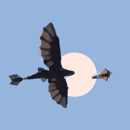

### Hi there 👋

- Check out recent Apps I developed. Available on PlayStore
  
  -  [  ByteChat: ](https://play.google.com/store/apps/details?id=com.offlinew.bytechat)   a **decentralized**, **peer-to-peer**, **offline** messaging and file sharing
  -  [  OffLine: ](https://play.google.com/store/apps/details?id=com.offlinew.android)   Local social media, local chats, short video <strong> without internet </strong> connections
  -  [ AutoCutAI: ](https://play.google.com/store/apps/details?id=com.offlinew.autocutai)  Automatic <strong>AI based Video Editor</strong>, automatic video editing using AI, zero effort video edit 
  -  [  Practica: ](https://play.google.com/store/apps/details?id=com.offlinew.practica) <strong> MCQ Practice App </strong>, multiple field, multiple subjects, tailored questions, and insightful analytics. 
- 👯 Right Now, I’m looking for collaboration in developing [Open Source Simple Video Editor (OSSAVE) ](https://github.com/mukuldeep/OSSAVE)
- 💬 Ask me about ...

### Featured Projects

- [OffLine](https://github.com/offlineApp/OffLine-Android-releases) — peer-2-peer internet-less short video application
- [AutoCutAI](https://github.com/mukuldeep/AutoCutAI) — Automatic AI video editor
- [LiveChain](https://github.com/LiveChain/LiveChain) — Lightweight blockchain for IoT with ECC
- [OSSAVE](https://github.com/mukuldeep/OSSAVE) — Open-source Android video editor

### Stats

### Frameworks & Languages

   

  
  
  

  
  
  <!--img src="https://img.shields.io/badge/UDEV-Device_Management-006699?style=for-the-badge&logo=linux&logoColor=white" alt="udev"/-->

  
  
  <!--img src="https://img.shields.io/badge/UART-Serial_Communication-1565C0?style=for-the-badge&logo=embedded&logoColor=white" alt="UART"/-->

  <!--img src="https://img.shields.io/badge/BSP-Board_Support_Package-4E342E?style=for-the-badge&logo=linux&logoColor=white" alt="BSP"/>
  
  

  
  
  

  
  

  

   
  
  
  
  
  
  
  

  
   
  
  
  
  
  

  
   
  
  
  
  
    
  
  

  
   
  
  
  

  
   
  
  
  
  

  
   
  
  
  
  

  
   
  
  
  
  
  
  
  

### Reachability
<!-- Social Media -->

  

<!--
**mukuldeep/mukuldeep** is a ✨ _special_ ✨ repository because its `README.md` (this file) appears on your GitHub profile.

 

  

   

<table style = "border: none;">
  <tr>
    <td style="border:none;">
      
    </td>
    <td style="border:none;">
      
       
      
    </td>
  </tr>
</table>

Here are some ideas to get you started:

- 🔭 I’m currently working on ...
- 🌱 I’m currently learning ...
- 👯 I’m looking to collaborate on ...
- 🤔 I’m looking for help with ...
- 💬 Ask me about ...
- 📫 How to reach me: ...
- 😄 Pronouns: ...
- ⚡ Fun fact: ...
-->
